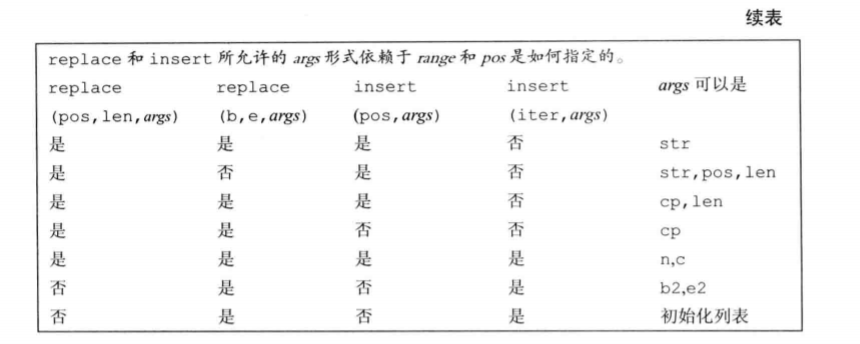

# 第9章 顺序容器

## 9.1 顺序容器概述

| 类型         | 功能                                                         |
| ------------ | ------------------------------------------------------------ |
| vector       | 可变大小数组。支持快速随机访问。在尾部之外的位置插入或删除元素可能很慢 |
| deque        | 双端队列。支持快速随机访问。在头尾位置插入/删除速度很快      |
| list         | 双向链表。只支持双向顺序访问。在list中任何位置进行插入/删除操作速度都很快 |
| forward_list | 单向链表。只支持单向顺序访问。在链表任何位置进行插入/删除操作速度都很快 |
| array        | 固定大小数组。支持快速随机访问。不能添加或删除元素           |
| string       | 与vector相似的容器，但专门用于保存字符。随机访问快。在尾部插入/删除速度快 |

选择容器的基本原则：

1. 除非你有更好的理由选择其他容器，否则应使用`vector`。
2. 如果你的程序有很多小的元素，且空间的额外开销很重要，则不要使用`list`或`forward_list`。
3. 如果要求随机访问元素，应使用`vector`或`deque`。
4. 如果程序需要在头尾位置插入或删除元素，但不会在中间的位置插入或删除操作，则使用`deque`。
5. 如果程序只有在读取输入时才需要在容器中间位置插入元素，随后需要随机访问元素则
   - 首先，确定是否真的需要在容器中间位置添加元素。当处理数据时，通常很容易地向`vector`追加数据，然后再调用标准库的`sort`函数。
   - 如果必须在中间位置插入元素，考虑在输入阶段使用`list`，一旦输入完成，将`list`中的内容拷贝到一个`vector`中。

如果不确定应该使用哪种容器，那么可以在程序中只使用`vector`和`list`公共操作：使用迭代器，不使用下标操作，避免随机访问。这样，在必要时选择使用`vector`或`list`都很方便。

## 9.2 容器库概览

| 类型别名        |                                                        |
| --------------- | ------------------------------------------------------ |
| iterator        | 此容器类型的迭代器                                     |
| const_iterator  | 可以读取元素，但不能修改元素的迭代器类型               |
| size_type       | 无符号整数类型，足够保存此类容器类型最大可能容器的大小 |
| difference_type | 带符号整数类型，足够保存两个迭代器之间的距离           |
| value_type      | 元素类型                                               |
| reference       | 元素左值类型，与value_type&含义相同                    |
| const_reference | 元素的const左值类型，(即，const value_type&)           |

| 构造函数        |                                                         |
| --------------- | ------------------------------------------------------- |
| C c             | 默认构造函数，构造空容器                                |
| C c1(c2)        | 构造c2的拷贝c1                                          |
| C c(b, e)       | 构造c，将迭代器b和e指定的范围内元素拷贝到c(array不支持) |
| C c{a, b, c...} | 列表初始化c                                             |

| 赋值与swap        |                              |
| ----------------- | ---------------------------- |
| c1=c2             | 将c1中的元素替换为c2中元素   |
| c1 = {a, b, c...} | 将c1中的元素替换为列表中元素 |
| a.swap(b)         | 交换a和b的元素               |
| swap(a, b)        | 与a.swap(b)等价              |

| 大小         |                                          |
| ------------ | ---------------------------------------- |
| c.size()     | c中元素的数目(不支持forward_list)        |
| c.max_size() | c可保存的最大元素数目                    |
| c.empty()    | 若c中存储了元素，返回false，否则返回true |

| 添加/删除元素(不适用与array) | 注：在不同容器中，这些操作的接口都不同 |
| ---------------------------- | -------------------------------------- |
| c.insert(args)               | 将args中的元素拷贝进c                  |
| c.emplace(inits)             | 使用inits构造c中的一个元素             |
| c.erase(args)                | 删除args指定的元素                     |
| c.clear()                    | 删除c中的所有元素，返回void            |
| 关系运算符                   |                                        |
| ==, !=                       | 所有容器都支持相等(不等)运算符         |
| <, <=, >, >=                 | 关系运算符(无序关联容器不支持)         |

| 获取迭代器             |                                           |
| ---------------------- | ----------------------------------------- |
| c.begin(), c.end()     | 返回指向c的首元素和尾元素之后位置的迭代器 |
| c.cbegin(), c.cend()   | 返回const_iterator                        |
| 反向容器的额外成员     | 不支持forward_list                        |
| reverse_iterator       | 按逆序寻址元素的迭代器                    |
| const_reverse_iterator | 不能修改元素的逆序迭代器                  |
| c.rbegin(), c.rend()   | 返回指向c的尾元素和首元素之前位置的迭代器 |
| c.crbegin(), c.crend() | 返回const_reverse_iterator                |

### 迭代器

左闭右开

| 容器定义和初始化 |                                                              |
| ---------------- | ------------------------------------------------------------ |
| C c              | 默认构造函数。如果C是一个array，则c中元素按默认方式初始化；否则c为空 |
| C c1(c2)         | c1初始化为c2的拷贝。c1和c2必须是相同类型，如果是array类型还必须相同大小 |
| C c{a, b, c...}  | c初始化为初始化列表中元素的拷贝。对于array类型，列表中元素数目必须小于或等于array的大小，任何遗漏的元素都进行值初始化 |
| C c={a, b, c...} | 同上                                                         |
| C c(b, e)        | c初始化为迭代器b和e指定范围中的元素的拷贝。array不适用       |
| C seq(n)         | seq包含n个元素，这些元素进行了值初始化；此构造函数是explicit的 |
| C seq(n, t)      | seq包含n个初始化为值t的元素                                  |

只有顺序容器(不包括array)的构造函数才能接受大小参数

| 容器赋值运算     |                                                              |
| ---------------- | ------------------------------------------------------------ |
| c1=c2            | 将c1中的元素替换为c2中元素的拷贝。c1和c2必须具有相同的类型   |
| c={a, b, c...}   | 将c1中元素替换为初始化列表中元素的拷贝(array不适用)          |
| swap(c1, c2)     | 交换c1和c2中的元素。c1和c2必须具有相同的类型。swap通常比从c2向c1拷贝元素快得多 |
| c1.swap(c2)      |                                                              |
|                  | assign操作不适用与关联容器和array                            |
| seq.assign(b, e) | 将seq中的元素替换为迭代器b和e所表示的范围中的元素。迭代器b和e不能指向seq中的元素 |
| seq.assign(il)   | 将seq中的元素替换为初始化列表il中的元素                      |
| seq.assign(n, t) | 将seq中的元素替换为n个值为t的元素                            |

赋值相关运算会导致指向左边容器内部的迭代器、引用和指针失效。而`swap`操作将容器内容交换不会导致指向容器的迭代器、引用和指针失效(容器类型为`array`和`string`的情况除外)

### 容器大小操作

- 成员函数`size`返回容器中元素的数目
- `empty`当`size`为0时返回布尔值`true`，否则返回`false`
- `max_size`返回一个大于或等于该类型容器所能容纳的最大元素数的值
- `forward_list`支持`max_size`和`empty`，但不支持`size`

## 9.3 顺序容器操作

| 操作                  | 解释                                                         |
| --------------------- | ------------------------------------------------------------ |
| c.push_back(t)        | 在c的尾部创建一个值为t或由args创建的元素。返回void           |
| c.emplace_back(args)  | 同上                                                         |
| c.push_front(t)       | 在c的头部创建一个值为t或由args创建的元素。返回void           |
| c.emplace_front(args) | 同上                                                         |
| c.insert(p, t)        | 在迭代器p指向的元素之前创建一个值为t或由args创建的元素，返回指向新添加的元素的迭代器 |
| c.emplace(p, args)    |                                                              |
| c.insert(p, n, t)     | 在迭代器p指向的元素之前插入一个n个值为t的元素。返回指向新添加的第一个元素的迭代器；若n为0，则返回p |
| c.insert(p, b, e)     | 将迭代器b和e指定的范围内的元素插入到迭代器p指向的元素之前。b和e不能指向c中的元素，返回指向新添加的第一个元素的迭代器；若范围为空，则返回p |
| c.insert(p, il)       | il是一个花括号包围的元素值列表。将这些给定值插入到迭代器p指向的元素之前。返回指向新添加的第一个元素的迭代器；若列表为空，则返回p |

- `forward_list`有自己专有版本的`insert`和`emplace`
- `forward_list`不支持`push_back`和`emplace_back`
- `vector`和`string`不支持`push_front`和`emplace_front`

将元素插入到`vector`、`deque`和`string`中的任何位置都是合法的，然而，这样做可能很耗时。

| 操作      |                                                              |
| --------- | ------------------------------------------------------------ |
| c.back()  | 返回c中尾元素的引用。若c为空，函数行为未定义                 |
| c.front() | 返回c中首元素的引用。若c为空，函数行为未定义                 |
| c[n]      | 返回c中下标为n的元素引用，n是一个无符号整数。若n>=c.size()，则函数行为未定义 |
| c.at(n)   | 返回下标为n的元素的引用。如果下标越界，则抛出一out_of_range异常 |

- `at`和下标操作只适用于`string`、`vector`、`deque`和`array`。
- `back`不适用于`forward_list`。

- 对一个空容器调用`front`和`back`，就像使用一个越界的下标一样，是一个严重的程序设计错误

### 删除元素

| 操作          |                                                              |
| ------------- | ------------------------------------------------------------ |
| c.pop_back()  | 删除c中尾元素。若c为空，则函数行为未定义。函数返回void       |
| c.pop_front() | 删除c中首元素。若c为空，则函数行为未定义。函数返回void       |
| c.erase(p)    | 删除迭代器p所指定的元素，返回一个指向被删元素之后元素的迭代器，若p指向尾元素，则返回尾后迭代器。若p是尾后迭代器，则函数行为未定义 |
| c.erase(b, e) | 删除迭代器b和e所指定范围内的元素。返回一个指向最后一个被删元素之后元素的迭代器，若e本身就是尾后迭代器，则函数也返回尾后迭代器 |
| c.clear()     | 删除c中的所有元素。返回void                                  |

- 这些操作都会改变容器大小，所以不适用于array
- `forward_list`有特殊版本的`erase`
- `forward_list`不支持`pop_back`；`vector`和`string`不支持`pop_front`
- 删除`deque`中除首尾位置之外的任何元素都会使所有迭代器、引用和指针失效
- 指向`vector`和`string`中删除点之后位置的迭代器、引用和指针都会失效
- 删除元素的成员函数并不检查其参数。在删除元素之前，程序员必须确保它(们)是存在的

### 特殊的forward_list操作

| 操作                      |                                                              |
| ------------------------- | ------------------------------------------------------------ |
| lst.before_begin()        | 返回指向链表首元素之前不存在的元素的迭代器。此迭代器不能解引用。cbefore_begin()返回一个const_iterator |
| lst.cbefore_begin()       |                                                              |
| lst.insert_after(p, t)    | 在迭代器p之后的位置插入元素。t是一个对象，n是数量，b和e是表示范围的一对迭代器。 |
| lst.insert_after(p, b, e) |                                                              |
| lst.insert_after(p, il)   |                                                              |
| emplace_after(p, args)    | 使用args在p指定的位置之后创建一个元素。返回一个指向这个新元素的迭代器。若p为尾后迭代器，则函数行为未定义 |
| lst.erase_after(p)        |                                                              |
| lst.erase_after(b, e)     |                                                              |

- 详情见书本313页

### 改变容器大小

| 操作           |                                                              |
| -------------- | ------------------------------------------------------------ |
| c.resize(n)    | 调整c的大小为n个元素。若n<c.size()，则多出的元素被丢弃。若必须添加新元素，对新元素进行值初始化 |
| c.resize(n, t) | 调整c的大小为n个元素。任何新添加的元素都初始化为值t          |

- `resize`不适用于`array`
- 如果`resize`缩小容器，则指向删除元素的迭代器、引用和指针都会失效
- 对`vector`、`string`或`deque`进行`resize`可能导致迭代器、引用和指针都会失效

### 容器操作可能使迭代器失效

- 在向容器添加元素后：
  - 如果容器是`vector`或`string`，且存储空间被重新分配，则指向容器的迭代器、指针或引用都会失效。如果存储空间未重新分配，指向插入位置之前的迭代器、指针和引用仍然有效，但指向插入位置之后的迭代器、指针和引用将会失效。
  - 对于`deque`，插入到除首尾位置只玩的任何位置都会导致迭代器、指针和引用失效。如果在首尾位置添加元素，迭代器会失效，但指向存在的元素的引用和指针不会失效。
  - 对于`list`和`forward_list`，指向容器的迭代器（包括尾后迭代器和首前迭代器）、指针和引用仍有效
- 删除一个元素后：
  - 对于`list`和`forward_list`，指向容器其他位置的迭代器（包括尾后迭代器和首前迭代器）、引用和指针仍有效
  - 对于`deque`，如果在首尾之外的任何位置删除元素，那么指向被删除元素外其他元素的迭代器、指针和引用也会失效，但其他迭代器、指针和引用不受影响；如果是删除首元素，这些也不会受影响
  - 对于`vector`和`string`，指向被删元素之前元素的迭代器、引用和指针仍有效。注意，当我们删除元素时，尾后迭代器总是会失效。

添加/删除`vector`、`string`或`deque`元素的循环程序必须考虑迭代器、引用和指针可能失效的问题。程序必须保证每个循环步中都更新迭代器、引用或指针，如果是调用`insert`或`erase`，这些操作都返回迭代器

不要保存`end`返回的迭代器

## 9.4 vector对象是如何增长的

`vector`和`string`的元素都是连续存储，所以为了避免大量的空间分配与释放，通常它们会分配比新的空间需求更大的内存空间。

| 容器大小管理操作  |                                           |
| ----------------- | ----------------------------------------- |
| c.shrink_to_fit() | 将capacity()减少为与size()相同的大小      |
| c.capacity()      | 不重新分配内存空间的话，c可以保存多少元素 |
| c.reserve(n)      | 分配至少能容纳n个元素的内存空间           |

- `shrink_to_fit`只适用于`vector`、`string`和`deque`
- `capacity`和`reserve`只适用于`vector`和`string`

每个`vector`实现都可以选择自己的内存分配策略，但是必须遵守的一条原则是：只有当迫不得已时才可以分配新的内存空间

## 9.5 额外的string操作

### 构造string的其他方法

| 构造string的其他方法     |                                                              |
| ------------------------ | ------------------------------------------------------------ |
| string s(cp, n)          | s是cp指向数组前n个字符的拷贝。此数组至少应该包含n个字符      |
| string s(s2, pos2)       | s是string s2从下标pos2开始的字符的拷贝。若pos2>s2.size()，构造函数的行为未定义 |
| string s(s2, pos2, len2) | s是string s2从下标pos2开始len2个字符的拷贝。若pos2>s2.size()，构造函数的行为未定义。不管len2的值是多少，构造函数至多拷贝s2.size()-pos2个字符 |
|                          |                                                              |

n、len2和pos2都是无符号值

| 子字符串操作     |                                                              |
| ---------------- | ------------------------------------------------------------ |
| s.substr(pos, n) | 返回一个string，包含s中从pos开始的n个字符的拷贝。pos的默认值为0，n的默认值为s.size()-pos，即拷贝从pos开始的所有字符 |

| 修改string的操作       |                                                              |
| ---------------------- | ------------------------------------------------------------ |
| s.insert(pos, args)    | 在pos之前插入args指定的字符。pos可以是一个下标或一个迭代器。接受下标的版本返回一个指向s的引用；接受迭代器的版本返回指向第一个插入字符的迭代器 |
| s.erase(pos, len)      | 删除从位置pos开始的len个字符。如果len被省略，则删除从pos开始直至s末尾的所有字符。返回一个指向s的引用 |
| s.assign(args)         | 将s中的字符替换为args指定的字符。返回一个指向s的引用         |
| s.append(args)         | 将args追加s。返回一个指向s的引用                             |
| s.replace(range, args) | 删除s中范围range内的字符，替换为args指定的字符。range或者一个下标和一个长度，或者是一对指向s的迭代器。返回一个指向s的引用 |

`args`可以是下列形式之一；`append`和`assign`可以使用所有形式。

`str`不能与`s`相同，迭代器b和e不能指向s。

|               |                                       |
| ------------- | ------------------------------------- |
| str           | 字符串str                             |
| str, pos, len | str中从pos开始最多len个字             |
| cp, len       | 从cp指向的字符数组的前(最多)len个字符 |
| cp            | cp指向的以空字符结尾的字符数组        |
| n, c          | n个字符c                              |
| b, e          | 迭代器b和e指定的范围内的字符          |
| 初始化列表    | 花括号包围的，以逗号分隔的字符列表    |

（贴个图，偷下懒，实在不想画表了，书本324页）

### string搜索操作

`string`搜索返回`string:: size_type`值，该类型是一个`unsigned`类型

| string搜索操作            |                                               |
| ------------------------- | --------------------------------------------- |
| s.find(args)              | 查找s中args第一次出现的位置                   |
| s.rfind(args)             | 查找s中args最后一次出现的位置                 |
| s.find_first_of(args)     | 在s中查找args中任何一个字符第一次出现的位置   |
| s.find_last_of(args)      | 在s中查找args中任何一个字符最后一次出现的位置 |
| s.find_first_not_of(args) | 在s中查找第一个不在args中的字符               |
| s.find_last_not_of(args)  | 在s中查找最后一个不在args中的字符             |

| args必须是以下形式之一 |                                                              |
| ---------------------- | ------------------------------------------------------------ |
| c, pos                 | 从s中位置pos开始查找字符c。pos默认为0                        |
| s2, pos                | 从s中位置pos开始查找字符串s2。pos默认为0                     |
| cp, pos                | 从s中位置pos开始查找指针cp指向的以空字符结尾的C风格字符串。pos默认为o |
| cp, pos, n             | 从s中位置pos开始查找指针cp指向的数组的前n个字符。pos和n无默认值 |

### compare函数

| compare几种参数形式    |                                                              |
| ---------------------- | ------------------------------------------------------------ |
| s2                     | 比较s和s2                                                    |
| pos1, n1, n2           | 将s中从pos1开始的n1个字符与s2进行比较                        |
| pos1, n1, s2, pos2, n2 | 将s中从pos1开始的n1个字符与s2中从pos2开始的n2个字符进行比较  |
| cp                     | 比较s与cp指向的以空字符结尾的字符数组                        |
| pos1, n1, cp           | 将s中从pos1开始n1个字符与cp指向的以空字符结尾的字符数组进行比较 |
| pos1, n1, cp, n2       | 将s中从pos1开始的n1个字符与指针cp指向的地址开始的n2个字符进行比较 |

### 数值转换

如果`string`不能转换为一个数值，这些函数抛出`invalid_agrument`异常

| string和数值之间的转换 |                                                              |
| ---------------------- | ------------------------------------------------------------ |
| to_string(val)         | 一组重载函数，返回数值val的string表示。val可以是任何算术类型 |
| stoi(s, p, b)          | 返回s的起始子串，返回值类型分别是int，p是size_t指针          |
| stol(s, p, b)          | long                                                         |
| stoul(s, p, b)         | unsigned long                                                |
| stoll(s, p, b)         | long long                                                    |
| stoull(s, p, b)        | unsigned long long                                           |
| stof(s, p)             | 返回s的起始字串（表示浮点数内容）的数值，返回值类型是float   |
| stod(s, p)             | double                                                       |
| stold(s, p)            | long double                                                  |

## 9.6 容器适配器

除顺序容器外，标准库还定义了三个顺序容器适配器：`stack`、`queue`和`priority_queue`。适配器是标准库中的一个通用概念。容器、迭代器和函数都有适配器。

| 操作           |                                                              |
| -------------- | ------------------------------------------------------------ |
| size_type      | 一种类型，足以保存当前类型的最大对象的大小                   |
| value_type     | 元素类型                                                     |
| container_type | 实现适配器的底层容器类型                                     |
| A a            | 创建一个名为a的空适配器                                      |
| A a(c)         | 创建一个名a的适配器，带有容器c的一个拷贝                     |
| 关系运算符     |                                                              |
| a.empty()      | 若a包含任何元素，返回false，否则返回true                     |
| a.size()       | 返回a中的元素数目                                            |
| swap(a, b)     | 交换a和b的内容，a和b必须有相同类型，包括底层容器类型也必须相同 |
| a.swap(b)      | 同上                                                         |

| 栈默认是基于deque实现 | 也可以在list或vector之上实现                                 |
| --------------------- | ------------------------------------------------------------ |
| s.pop()               | 删除栈顶元素，但不返回该元素值                               |
| s.push(item)          | 创建一个新元素压入栈顶，该元素通过拷贝或移动item而来，或者由args构造 |
| s.emplace(args)       | 同上                                                         |
| s.top()               | 返回栈顶元素，但不将元素弹出栈                               |

|                 |                                                              |
| --------------- | ------------------------------------------------------------ |
| q.pop()         | 返回queue的首元素或priority_queue的最高优先级的元素，但不删除此元素 |
| q.front()       | 返回首元素或尾元素，但不删除此元素                           |
| q.back()        | 只适用于queue                                                |
| q.top()         | 返回最高优先级元素，但不删除该元素                           |
| q.push(item)    | 在queue末尾或priority_queue中恰当的位置创建一个元素，其值为item，或者由args‘构造 |
| q.emplace(args) |                                                              |

